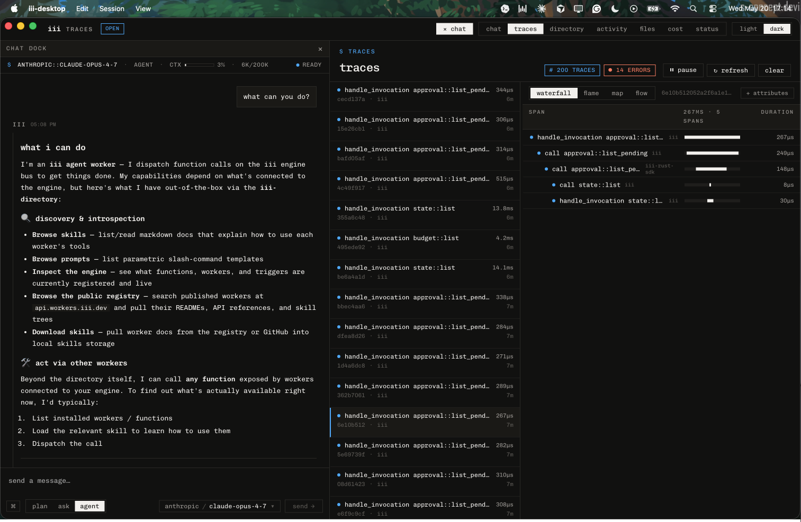

# iii-desktop

Native desktop shell for the iii engine. Tauri 2 in Rust, React renderer on
`iii-browser-sdk`, traces and chat on top of the canonical iii harness
graph from [`iii-hq/workers`](https://github.com/iii-hq/workers).



The renderer never speaks REST. Every action is `iii.trigger(...)` over
the engine WebSocket against `harness::*`, `engine::traces::*`,
`directory::*`, `run::*`, `models::*`, `router::*`, `approval::resolve`,
and the locally-registered `desktop::*` worker.

## What ships

- Header with view tabs · light/dark toggle · chat-dock toggle · connection pill.
- Left-sticky resizable chat dock with status bar (`$ provider::model · agent · ctx ▓░ % · used/max · ready/busy/paused`).
- Composer with `plan | ask | agent` mode toggle, model picker, send arrow.
- 7 views in the top tab strip: **chat · traces · directory · activity · files · cost · status**.
- 3-column **traces** UI matching the iii console: virtualized list, depth-aware waterfall, canvas flame graph, service map (xyflow), span flow tree (dagre), span panel with `info | attributes | events | errors | logs | context`.
- Streaming chat with parts-array reducer (`agent_start | turn_start | message_start | message_update | message_end | function_execution_start | function_execution_update | function_execution_end | turn_end | turn_state_changed | agent_end`). Tool calls render inline with collapsible args + result. Approval prompts surface inline.
- Command palette via `⌘K` with session, view, model, action groups.
- Native menu, deep links (`iii://`), file/folder pickers, window-focus from any bus caller via `desktop::window::focus`.

## Design

Adopts the iii Schematic design system: cream paper (`#f2f0ed`), ink
(`#0a0a0a`), single hot-orange accent (`#ff5a1f`), Chivo Mono everywhere,
zero rounded corners except the 6px status dots, borders define every
container. Dark theme swaps to ink paper (`#111110`) and electric blue
accent (`#3ea8ff`). Light is canonical; persistence to `localStorage`
under `iii-desktop:theme`. Inline `<head>` script applies the theme
before paint to avoid flash.

## Status

`0.x`. Stays sub-1.0 until the shell is in real production use against a
running engine + harness.

## Prerequisites

- Rust stable (`rustup toolchain install stable`)
- Tauri CLI (`cargo install tauri-cli --version "^2"`)
- Node 20 + pnpm 9 (`corepack enable && corepack prepare pnpm@9 --activate`)
- A running iii engine. Bare `iii` runs the engine in the foreground (there is no `iii start` subcommand).

  ```bash
  curl -fsSL https://install.iii.dev/iii/main/install.sh | sh
  iii worker add harness                  # pulls the full chat-graph bundle transitively
  iii worker add iii-observability        # required for the traces tab
  iii                                     # foreground engine; no subcommand
  ```

  Engine subcommands: `iii trigger`, `iii worker`, `iii console`,
  `iii sandbox`, `iii cloud`, `iii create`, `iii update`.

  Provider API keys: `auth-credentials` reads them from the environment
  of the process that spawns the workers, so `export ANTHROPIC_API_KEY`
  / `OPENAI_API_KEY` before running `iii`.

  Traces tab needs `iii-observability` configured with `exporter: memory`
  (or `both`). `iii worker add iii-observability` writes the right
  config block.

## Dev

```bash
pnpm --dir web install
cargo tauri dev
```

`cargo tauri dev` is the canonical entry. It runs `pnpm --dir web dev`
in the background, watches `src-tauri/`, and rebuilds the shell on
change.

Engine survival on macOS: the included `scripts/run-engine.sh` raises
`ulimit -n 8192` (default 256 kills the engine in seconds) and sources
either `./.env` or `~/agentsos/.env` so it inherits provider keys.
`scripts/run-engine.sh` is what `cargo tauri dev` expects beside it.

## Build

```bash
pnpm --dir web build
cargo tauri build
```

Output bundles land in `src-tauri/target/release/bundle/`. CI matrices
across macOS arm64 + x86_64, Linux x86_64, and Windows x86_64 are wired
in `.github/workflows/release.yml`, triggered on `v*` tags.

## Configuration

Environment variables read at launch:

| Var | Default | Meaning |
|---|---|---|
| `III_URL` | `ws://127.0.0.1:49134` | Backend engine WS (for the desktop worker). |
| `VITE_III_BROWSER_URL` | unset | Override the browser worker WS. Skips the `bridge::info` round-trip. |
| `ANTHROPIC_API_KEY` etc | unset | Read by `auth-credentials`. Export before launching the engine. |

The desktop worker auto-detects the engine over `III_URL`. The renderer
defaults to the same `:49134` host since the engine RBAC layer routes
browser workers without a separate browser port on the canonical
harness install.

## Wire shape

The renderer is an iii worker. On boot it:

1. Connects via `iii-browser-sdk::registerWorker(III_URL)`.
2. Mints a stable `browser_id` and registers
   `ui::session::event::<browser_id>` for live `agent::events`.
3. Calls `ui::subscribe { browser_id, session_id }` so the harness
   fanout knows which sessions to forward.
4. Sends each turn as a fire-and-forget `run::start { session_id,
   provider, model, messages }` (`TriggerAction.Void()`). The engine
   acks immediately and streams events back through the
   `ui::session::event` pump.
5. Cancels in-flight turns via `router::abort { session_id }`.
6. Resolves pending approvals via `approval::resolve { session_id,
   function_call_id, decision: "allow" | "deny" }`.

Messages going into `run::start.messages[]` must use content blocks
(`[{ type: "text", text: "..." }]`, not a bare string), include a
`timestamp` (i64 ms), and — for assistant turns being replayed in
history — carry `stop_reason`, `provider`, `model`, and `usage`.

The desktop worker registers two functions on the backend port:

- `desktop::status` — liveness probe; returns `{ name, version }`.
- `desktop::window::focus` — show the main window and bring it to the
  front. Use from approval gates, long-running tool results, or deep
  link landings.

Skill bundle for the worker (per
[`DOCUMENTATION_GUIDELINES.md`](https://github.com/iii-hq/workers/blob/main/DOCUMENTATION_GUIDELINES.md))
lives under [`skills/iii-desktop/`](./skills/iii-desktop/) and is
indexed automatically by `iii-directory`.

## Traces

Traces tab consumes:

- `engine::traces::list { limit?, offset?, include_internal? }` —
  paginated `{ spans: StoredSpan[], total }`. Polled every 3s while
  the tab is visible and unpaused.
- `engine::traces::tree { trace_id }` — `{ roots: SpanTreeNode[] }`
  on row selection.
- `engine::traces::clear {}` — wipe the in-memory span store.

If the engine has no `iii-observability` worker, the panel surfaces a
"otel exporter not enabled" notice with the exact config block to add.

Views: **waterfall** (virtualized via `@tanstack/react-virtual`, depth
indent, bar `left%`/`width%` from `start_time_unix_nano`), **flame**
(canvas, HiDPI, monochrome 4-step depth cycle, theme-aware via
`getComputedStyle` on `data-theme`), **map** (`@xyflow/react` services
aggregated by `service_name`), **flow** (`@xyflow/react` + `dagre` one
node per span). Click a bar/cell to open the span panel.

## Layout

```
.
├── src-tauri/             Rust shell
│   ├── src/
│   │   ├── main.rs        thin bin entry
│   │   ├── lib.rs         tauri::Builder + plugin wiring
│   │   ├── worker.rs      iii-sdk worker registration
│   │   ├── menu.rs        native menu
│   │   └── functions/     Tauri IPC commands (window, dialog, engine)
│   ├── capabilities/      Tauri 2 capability scopes
│   └── tauri.conf.json
├── web/                   Vite + React renderer
│   └── src/
│       ├── App.tsx                  header + view routing + chat dock
│       ├── components/
│       │   ├── ChatPanel.tsx        chat dock + main chat view
│       │   ├── ChatDock.tsx         resizable left-sticky drawer
│       │   ├── Composer.tsx         textarea + plan/ask/agent toggle
│       │   ├── StatusBar.tsx        provider::model · ctx · status
│       │   ├── TracesPanel.tsx      3-column traces UI
│       │   ├── DirectoryPanel.tsx   skills + registry browse
│       │   ├── ActivityPanel.tsx    workers + sandboxes + sessions
│       │   ├── traces/
│       │   │   ├── TraceList.tsx
│       │   │   ├── WaterfallChart.tsx
│       │   │   ├── FlameGraph.tsx
│       │   │   ├── TraceMap.tsx
│       │   │   ├── FlowView.tsx
│       │   │   ├── SpanPanel.tsx
│       │   │   └── ViewSwitcher.tsx
│       │   └── …
│       ├── lib/
│       │   ├── iii-client.ts        iii-browser-sdk wrapper
│       │   ├── useAgentStream.ts    agent::events reducer (12 variants)
│       │   ├── traces-api.ts        engine::traces::{list,tree,clear,group_by}
│       │   ├── trace-transform.ts   iterative depth + DFS flatten
│       │   ├── use-trace-data.ts    polling + newness tracking
│       │   ├── use-resizable-panels.ts  drag-resize column hook
│       │   ├── theme.ts             light/dark toggle
│       │   └── …
│       └── styles/                  iii schematic tokens
├── skills/iii-desktop/    skill bundle (index + per-function how-tos)
├── scripts/run-engine.sh  ulimit + .env wrapper for engine boot
└── .github/workflows/     ci + release
```

## License

Apache-2.0
